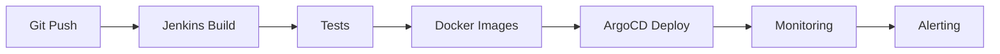

#  DevOps Tools - Jarvis V1.4.0

##  Structure des outils DevOps

```
devops-tools/
 jenkins/              # CI/CD Pipeline
    docker-compose.yml
    Jenkinsfile
    plugins.txt
 argocd/               # GitOps Deployment
    docker-compose.yml
    applications/
 monitoring/           # Observabilité complète
    prometheus/
    grafana/
    loki/
    docker-compose.yml
 configs/              # Configurations partagées
    nginx/
    ssl/
 README.md
```

##  Objectifs DevOps

###  CI/CD (Jenkins)
- Build automatique des images Docker
- Tests unitaires et intégration 
- Déploiement automatisé
- Notifications Slack/Discord

###  GitOps (ArgoCD)
- Déploiement déclaratif
- Sync automatique Git → Cluster
- Rollback automatique
- Interface graphique

###  Monitoring (Prometheus + Grafana + Loki)
- Métriques système et applicatives
- Dashboards temps réel
- Alerting intelligent
- Logs centralisés

##  Ports utilisés

| Service | Port | Description |
|---------|------|-------------|
| Jenkins | 8080 | Interface Web CI/CD |
| ArgoCD | 8081 | Interface GitOps |
| Grafana | 3001 | Dashboards monitoring |
| Prometheus | 9090 | Métriques |
| Loki | 3100 | Logs centralisés |

##  Démarrage rapide

```bash
# Lancer la stack complète DevOps
cd devops-tools/
docker-compose up -d

# Ou par service
docker-compose -f jenkins/docker-compose.yml up -d
docker-compose -f monitoring/docker-compose.yml up -d
```

##  Configuration initiale

1. **Jenkins** : http://localhost:8080
   - Admin password : `docker logs jenkins | grep -A2 "password"`
   
2. **ArgoCD** : http://localhost:8081
   - User: `admin` / Password: `argocd-server get initial password`
   
3. **Grafana** : http://localhost:3001
   - User: `admin` / Password: `admin`

##  Workflow DevOps



---
**Créé par** : Instance Claude #28  
**Date** : 2025-08-21  
**Version** : Jarvis DevOps v1.0